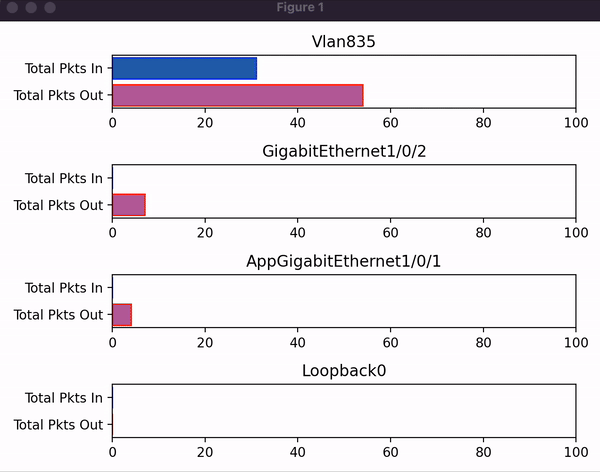

[](https://developer.cisco.com/codeexchange/github/repo/eiuemura/cisco-dnac-show-diff-stats)

# Cisco DNA Center - show difference counter in real-time
---

## Why?
If you have to perform some troubleshooting, this sample code may be helpful. This is because finding out which counter value is increasing is as essential as understanding the root cause of the problems occurring in the network devices.

This tool can easily visualize the difference of the counter, such as 'show interface stats' and 'show interface,' which shows how much increased since this program was executed.

A sample code will also help you understand the command runner, one of the DNAC API features, and Genie parser.

## Technologies & Frameworks Used

**Cisco Products & Services:**

- Cisco DNA Center
  - https://sandboxdnac.cisco.com (or use your own)


**Tools & Frameworks:**

- Python3
- Genie: Command paser(pyATS)
- Matplotlib: Visualization with Python

## Installation

```
git clone https://github.com/eiuemura/cisco-dnac-show-diff-stats
```

```
pip install -r requirements.txt
```

## Running the code

```python3 show_diff_stats.py```


### Trouble shooting
If you found the following error, this command can fix the problem.


TypeError: Couldn't find foreign struct converter for 'cairo.Context'

```
sudo apt-get install python3-gi-cairo
```

### Sample Screenshot

